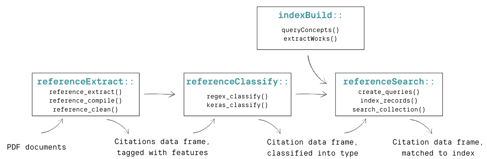

---
# Feel free to add content and custom Front Matter to this file.
# To modify the layout, see https://jekyllrb.com/docs/themes/#overriding-theme-defaults

layout: home
---
https://github.com/govscienceuseR
Tools for automated extraction and disambiguation of scientific resources cited in government documents.  

1. [referenceExtract](https://github.com/govscienceuseR/referenceExtract): Process PDFs and tag citations/references observed in PDFs  
2. [referenceClassify](https://github.com/govscienceuseR/referenceClassify): Clean and classify citations by category (e.g., academic journal, agency document)  
3. [indexBuild](https://github.com/govscienceuseR/indexBuild): Create a database of academic work to search against for disambiguation of extracted citations  
4. [referenceSearch](https://github.com/govscienceuseR/referenceSearch): Search extracted citations against indexed database of canonical citations to match and disambiguate extracted citations 

Check out a worked example applied to the [science informing California's Groundwater Sustainability Plans](https://htmlpreview.github.io/?https://github.com/govscienceuseR/vignettes/gsp_vignette.html). 
